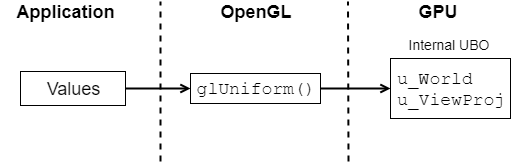
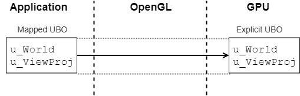
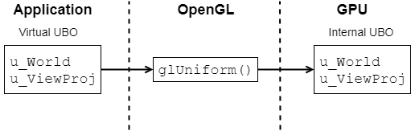

# Project document

## Asset pipeline

The game needs hand-crafted assets, such as sounds, textures, and models.
They are authored using some content creation tools and exported in exchange
formats like *.wav*, *.png*, and *.fbx* respectively. The engine could load
these formats directly, but it would be inefficent since they might have lots
of extra data that the game doesn't care about or be in a format that is very
expensive to convert into an usable form. Thus there needs to be preprocessing
of some sort, that converts the source assets into something the engine can
understand. These are custom formats and they have extensions with the prefix
*.s2XX* (named after the course, Studio 2), for example textures are processed
into *.s2tx* files.

&shy;

The simplest way to implement this processing is to go through all the assets
and convert them depending on their filetype. This works pretty well up to a
point. However, there are cases when you want to process the same file extension
in a different way depending on the context. If a *.png* file is used as a
texture on a model it should be processed in isolation, but if it is an UI
element it should be merged with others into a [sprite sheet][wiki-sprite-sheet].
You could hack around it for example by specifying textures as *.tga* files
and sprites as *.png* files, but this is just delaying the inevitable. The
real solution to the issue is to introduce some files for metadata and not
proecss the resources automatically. This metadata is stored as [*.toml*][gh-toml] files.

&shy;

Even though the resources need different kinds of processing there are
significant processing steps that are shared between them. This is resolved
using an internal representation for the assets, which decouples the asset
importing from the processing. For example loaded image files are converted to __Image__
objects that contain the pixels of the image in an easy-to-manipulate way.
There is another internal format for image data called __Texture__. Unlike
__Image__, the data in them is *opaque* and cannot be operated upon. __Texture__
objects may contain [block compressed][wiki-texture-compression] data and
[mipmaps][wiki-mipmap]. All image data must be converted to __Texture__ before
saving it for the engine.

&shy;

The processed results can be cached if the source files do not change between
processing runs. To avoid stale caches we need to keep track of all the source
files and metadata that influence each output file. When saving processed output
files a file containing the timestamps and hashes of the input files is saved
to a temporary cache directory mirroring the output structure. The processing
application compares this directory to the source files to determine which files
need to be reprocessed.

## OpenGL options

[OpenGL][about-opengl] is a standardized graphics API that the game uses to
render all its content. More specifically, the game requires the version 3.3
of the OpenGL API. OpenGL is quite a high-level API, which lends itself to
varying quality of driver implementations: Some patterns, even if correct in
the OpenGL API, are unbearably slow on actual implementations. Some features
may be even broken (for example issue #1). OpenGL also gives the freedom to
use features found in the newer versions given that you query that they are
actually available.

To work around implementation issues and take advantage of newer OpenGL features
the low-level rendering code accumulated lots of options collected in `OptsGl`.

### Uniform buffers

The primary way to pass data to shaders is to use [uniform][gl-uniform] variables.
As the name implies these are constant for all shader invocations in a single
draw call. For example let's take a simple vertex shader that has a few uniform
matrices:

```glsl
uniform mat4 u_World;
uniform mat4 u_ViewProj;
```

#### Old-style uniforms

&shy;

The old-school way to pass the uniform data to the shader is to query the
uniform locations and pass the data using the `glUniform()` family of calls:

```scala
// Query the locations of the uniforms (needs to be done only once)
val locWorld = glGetUniformLocation(program, "u_World")
val locViewProj = glGetUniformLocation(program, "u_ViewProj")

// Set the values using the uniform locations
glUseProgram(program);
glUniformMatrix4fv(locWorld, ...)
glUniformMatrix4fv(locViewProj, ...)
```


The advantage of this method is that it's pretty high-level, so it's easy to
use and the driver has a lot of the freedom to do optimizations. However, this
results in a lot of API calls, increased variance between different platforms,
and reduced ability to re-use uniforms between shaders and frames. For example
there is no way to store the uniforms for static objects between frames, instead
they have to be re-uploaded each frame.

#### Uniform Buffer Objects

&shy;

Fortunately OpenGL 3.1 standardized [uniform buffer objects][gl-ubo], or UBO for
short. Uniform buffer objects are chunks of memory that can be read by shaders.
Applications may write the uniform values into them directly without any API
calls. Also they can be stored in memory and re-used as needed.

To use uniform buffers instead of plain uniforms the shader declarations must be
wrapped in an UBO block:
```glsl
uniform UBO {
	mat4 u_World;
	mat4 u_ViewProj;
};
```

The usage code is more complicated as it requires wrangling with a buffer, but
now all the per-uniform API calls are gone. Since this method is lower level
it leaves less chances for the GL driver to mess things up.

```scala
// Find the UBO and bind it to some (arbitrary) index
val UboBinding = 1
val index = glGetUniformBlockIndex(program, "UBO")
glUniformBlockBinding(program, index, UboBinding)

// Write the uniform data to the mapped buffer
glBindBuffer(GL_UNIFORM_BUFFER, buffer)
val data = glMapBufferRange(GL_UNIFORM_BUFFER, offset, size, ...)
writeMatrix(data, ...)
writeMatrix(data, ...)
glUnmapBuffer(GL_UNIFORM_BUFFER);

// Before doing a draw call bind the buffer
glBindBufferRange(GL_UNIFORM_BUFFER, UboBinding, buffer, offset, size)
```

The above example can be improved further by using [persistent mapping][gl-persistent],
which gets rid of nearly all the buffer mapping related calls. Uniform buffer
objects majorly sidesteps the OpenGL
driver and give the application a closer access to the GPU itself. Sadly UBOs
are not supported on WebGL 1.0 and GLES 2.0, which are still considerable targets.
Also the implementation may have some serious bugs as is in the case of some macOS
drivers.

#### Virtual UBOs

&shy;

Instead of sacrificing UBOs for compatability, this engine takes another approach:
The uniforms are _always_ written to a buffer, even when not supported by the
platform. In case there is no support for uniform buffers, the buffer is a
"virtual UBO" that is just a chunk of application memory with a known layout.
The uniform values are later copied from this buffer using the `glUniform()` API.
Now the code for writing the uniforms is exactly the same no matter whether UBOs
are used or not: only the destination where they're written is different.

```scala
// Alternative implementations: Map buffer or allocate "virtual UBO"
val data = if (hasUboSupport) {
	glBindBuffer(GL_UNIFORM_BUFFER, buffer)
	glMapBufferRange(GL_UNIFORM_BUFFER, offset, size, ...)
} else {
	MemoryUtil.memAllocStack(size)
}

// Unified part: Write the uniforms into some UBO
writeMatrix(data, ...)
writeMatrix(data, ...)

// Alternative implementations: Bind UBO or upload uniforms one-by-one
if (hasUboSupport) {
	glUnmapBuffer(GL_UNIFORM_BUFFER);
	glBindBufferRange(GL_UNIFORM_BUFFER, UboBinding, buffer, offset, size)
} else {
	glUseProgram(program);
	glUniformMatrix4fv(locWorld, data.sliced(0, 64))
	glUniformMatrix4fv(locViewProj, data.sliced(64, 64))
}
```

### Buffer mappings

As explained above, the engine uses uniform buffer objects where available.
This raises the question: How do you transfer the UBO data to the GPU?
It turns out that as is with most of OpenGL there is no clear solution.
Different styles are faster on different hardware and drivers, some things
can be flat out broken, the usual. So to deal with this there are lots of
ways to map buffers in the engine. Not only for uniform buffers, but for
example dynamic vertex data needs to be transferred somehow.

The two cases (uniform buffer objects and dynamic vertex buffers) have different
write patterns which affects the type of mapping we want. Uniforms tend to be
written out of order to the buffer and may even leave gaps. In contrast, vertex
data tends to be streamed out in a very linear fashion. The reason this matters
is that if the driver hands out a mapping to the GPU memory, it will most likely
be [write combined][wiki-wc]. Write combined memory doesn't behave well with
[erratic write patterns][ryg-wc]: While a perfect match for vertex data it
is not suitable uniform buffers. The solution the engine takes is that uniform
data is first written to a CPU local buffer and then copied to GPU memory in one
piece.

&shy;

When working with older drivers the engine uses `glBufferSubData()` for uniform buffers.
The `glBufferSubData()` call copies data to a GPU buffer in a pretty unspecified way,
which isn't ideal but it's better than doing tons of tiny mappings for every UBO.
Vertex data uses the `glMapBuffer()` API with `GL_UNSYNCHRONIZED_BIT`, which
should give the application a chunk of write combined GPU memory. The drawback is
that this can (ironically) cause synchronization stalls especially in multithreaded drivers.

&shy;

While the game only requires OpenGL 3.3, if the presence of the [`GL_ARB_buffer_storage`][gl-arb-buffer-storage]
extension is detected the engine uses persistent mapping. As the name implies
persistent mapping lets the application map the buffer into memory _once_ and
write to it even while the driver is using it. As with the legacy case uniform
buffers are not written directly to the GPU, but this time manually copied through
a local buffer. Vertex data is written directly to the GPU without almost any
API overhead from OpenGL.

OpenGL still needs some way to know when to flush the data from the mapping to
the GPU. To do this there are two options: Explicit flushing and coherent buffers.
When the buffers are created and mapped with explicit flushing enabled the
application needs to call `glFlushMappedBufferRange()` after writing to guarantee
that the data is visible to the GPU. If the buffer is coherent, this is not
required and the data is automatically guaranteed to reach the GPU. There is
no clear winner here: The two approaches need to be benchmarked and unfortunately,
most likely different drivers and hardware will have wildly different results.

There is one exception to the mapping of buffers: If OpenGL compatability mode
is requested, for example with `--gl-compat` __everything__ is mapped with
`glBufferSubData()`. This is due to it being the most foolproof API.

## Post-mortem

In this section I evaluate the technical choices I have made during the project
and look at what worked and what could have been done differently. The topics
listed will be in roughly chronological implementation order.

#### Multi-project setup

Right at the start I wanted to separate the project into sub-projects that could
be build independently. This differs from just doing sub-packages by giving more
control over name visibility (eg. `engine` project has absolutely no way to
access anything from `game`). The project structure also allows the containment of external
libraries with the most important case being the asset importing libraries used by
the `resource` project. As the final game project should have no dependency on
`resource` so the (usually big or awkwardly licensed) asset libraries can be
omitted from the final distribution.

At the start I decided _not_ to do a top-level package for each project to make
it easier to refactor components from project to project. In the end this probably
was not the best idea and the final real project `game` got its own top-level
package.

#### TOML

When starting to build the prototype asset processing pipeline it turned out
that configuration files are a necessity. The options for the file format were
[JSON][json], [YAML][yaml], [TOML][gh-toml], and some custom format. I discarded
JSON first as it doesn't have comments and has an unfortunate amount of line-noise
for simple configuration purposes. YAML on the other hand looks pretty nice but
is overly complicated. TOML is a very minimalistic .ini-inspired _config file format_,
which seemed like a nice match. TOML still lacked some features which almost caused
me to develop a custom domain-specific configuration format, but the gains from it
were outweighed by the technical complexity of having a custom language in system.
The project contains a very minimalistic TOML-subset parser initially meant for
testing the asset system, but it has worked well enough that it never needed to be
replaced.

#### SimpleSerialization

Now that we have the ability to read configuration files it would be nice to be
able to deserialize them into some kind of structures in the code. I dabbled for
a while with macros and Java-based reflection but didn't like how magical those
solutions turned out to be so I made the simplest thing possible: A visitor that
manually goes through every field. This works alright but caused some bugs to
appear every now and then by forgetting to update the `visit()` method. Still
these bugs were minor enough and quick to diagnose so the system stood the test
of time.

For example here's an abridged source snippet from the top-level asset config
structure:
```scala
/** Root of the asset configuration file */
class Config extends SimpleSerializable {
  var filter = new ArrayBuffer[Filter]()
  var importer = new Importer()
  var res = new Res()
  var priority = 0.0

  override def visit(v: SimpleVisitor): Unit = {
    filter = v.field("filter", filter, new Filter)
    importer = v.field("importer", importer)
    res = v.field("res", res)
    priority = v.field("priority", priority)
  }
}
```

The `SimpleSerialization` also worked for binary serialization, which is used
to generate hashes of the configuration files for asset processing caching.

#### Asset processing

The asset processing is based on importers which import asset files into an
intermediate representation, processes which operate on said intermediate objects,
and output formats which serialize the asset to an engine-readable form. This
structure was flexible enough to support most of what needed to be done. Still
some features that I wanted to do were blocked by this structure. Sharing meshes
between different models didn't really work out. Pre-processing shaders imports
on process-time didn't work because of the dependency system. [Fixing texture UV seams][sylvan-uvopt]
would have been hard to fit as models and textures are independent, in addition to
the algorithm being a ton of work. On the positive side tacking on multithreading
onto the resource processer was trivial.

#### OpenGL wrapper

I'm very happy of the abstraction that built around OpenGL in the engine. It
grew quite organically around the current needs of whatever I was doing, but
it still turned out pretty flexible. The shader specification heavily uses Scala's
`object`-singletons to define blocks of information. The trick that made the
vertex specification API nice in my opinion is the lack of having to manually
keep track of strides and offsets. This works by the engine contiguously layouting
the vertex elements by their size. To support gaps you can create attributes with
type `PAD`, but this was never necessary in actual use-cases.

```scala
object UpsampleMsaaShader extends ShaderAsset("shader/msaa_upsample") {

  uniform(VertexUniform)
  object VertexUniform extends UniformBlock("VertexUniform") {
    val TextureScale = vec4("TextureScale")
  }

  override object Permutations extends Shader.Permutations {
    val SampleCount = frag("SampleCount", Array(2, 4, 8, 16))
  }

  override object Textures extends SamplerBlock {
    val Multisample = sampler2DMS("Multisample")
    val SubsampleWeights = sampler2DArray("SubsampleWeights", Sampler.ClampBilinearNoMip)
  }
}

val GroundSpec = VertexSpec(Vector(
  Attrib(3, F32, Identifier("Position")),
  Attrib(3, F32, Identifier("Normal")),
  Attrib(4, UI8, Identifier("ProbeIndex")),
  Attrib(4, UN8, Identifier("ProbeWeight")),
))
```

#### UI rendering

When making the font implementation I had one goal: Readable subpixel small fonts.
I spent a lot of time with `stb_truetype`s [font oversampling][gh-stb-oversample].
Sadly in the end after I got it working artifact-free it looked worse than simple
SDF implementation with large textures. The oversample-codepath still exists, but
is not used by any font. Otherwise the font rendering turned out fine, and using
uniform buffers it's able to squeeze a lot of text to different draw-calls.

To reduce the amount of draw-calls used by the 2D rendering, I made the observation
that the way I generate the atlases makes some amount of full-size pages and one
left-over texture page. Instead of creating a new draw-call every time a sprite is
rendered from another page I joined the first pages into one array texture and keep
the last one as separate. When rendering the sprites there is a  branch on whether
to use the array texture or the final one. This goes against the wisdom of no
branching in shaders, but it should be fine as the branch is very uniform.

#### Word wrapping

When I decided to add word-wrapping support to the text rendering I got the idea
of adding [soft hyphens][wiki-shy] to the localized text at processing time. First
idea was to use a dictionary for each language. This worked for English but after
some searching I couldn't find a Finnish one, so I adapted the hyphenation algorithm
from [`vepasto/finnish-hyphenator`][gh-finnish-hyphenator]. The first implementation
hyphenated at every chance which made the text a little hard to read, so I added a
tweakable threshold controlling how much empty space created if the word would be
wrapped as a whole.

#### Shading system

This is probably my biggest gripe with the engine. From the first render output
I got it became apparent that this game seriously needs antialiasing with the
small but polygonal towers. I decided to use [MSAA][wiki-msaa], since it's easy to
implement while resulting in good quality. Another option would be to use some
post-process antialiasing like [FXAA][wiki-fxaa], but I don't like the blurring it introduces.
Temporal antialiasing could have worked out but I didn't want to implement it for
this project. MSAA has one big drawback: it is very memory intensive for the render
targets, which means [deferred shading][wiki-deferred] is not really an option, since it requires
very fat G-buffers as well. Deferred texturing could have worked as an alternative,
but it requires the engine to be built around it. I would have wanted to use [clustered shading][pdf-clustered],
but since I wanted the game to require only OpenGL 3.3 it would have been very impractical
to implement without compute shaders. This left me with forward shading, which is
not a good solution to the combinatoric problem of lights and objects.

#### Systems and scheduler

This is another thing in the engine that I'm pretty happy about. The entities
of the scene is split into systems. The systems can be updated on multiple
threads using the `Scheduler` API and specifying the dependencies between different
update phases. This worked wonderfully and could be extended further with adding
possibilities to splitting updates into overlapping tasks and creating some sort
of mutual exclusion dependency, for when tasks `A` and `B` may not run at the same time,
but `A -> B` and `B -> A` are both valid.

#### Tonemapping

Using physically based linear high-dynamic-range light values in the renderer means that the resulting image
doesn't fit well for monitors to display. This means we need to apply a [tonemapping][wiki-tonemap]
function to the image to compress it for the low-dynamic-range display. First, I tried to implement
John Hable's [Filmic Tonemapping with Piecewise Power Curves][fw-piecewise-tonemap], but I wasn't
satisfied with how it was turning out. Then I decided to go with [the lookup table approach][witness-colorgrade]
in which you can take a snapshot from the game with an identity color matrix, manipulate
that image in any software of your choosing, then extract the color transformation from the
now transformed color matrix.

I wanted the exported reference image to have more than 8 bits per channel for HDR
data. This means that the simplest export format [bmp][wiki-bmp] is off the table.
I wanted to find a high bitdepth file format that [Krita][krita] supports, which
wouldn't require any compression on the exporting end (so 16-bit [png][wiki-png]
are out). First I implemented a [TIFF][wiki-tiff] exporter which seemed to work
fine and was good enough to author the main menu colorgrade, but after adding
textures to the game it turned out something was off: Krita didn't support TIFF's
[TransferFunction][tiff-transferfunction], which meant that I couldn't represent
HDR data without serious banding. To fix this I implemented a minimal [OpenEXR][wiki-openexr]
exporter which is nice (apart from the absolutely baffling file format) since it
supports floating point image data.

In the end the lookup method to tonemapping works fine even for HDR to LDR transform
when using a lookup table that covers a fixed maximum exposure and has sample points
distributed in a square curve. A nice detail of the asset processing sytem is that you can
save the modified screenshots as-is (instead of having to crop the color matrix)
which gives some context to the raw assets.

[wiki-sprite-sheet]: https://en.wikipedia.org/wiki/Texture_atlas
[wiki-texture-compression]: https://en.wikipedia.org/wiki/Texture_compression
[wiki-mipmap]: https://en.wikipedia.org/wiki/Mipmap
[wiki-wc]: https://en.wikipedia.org/wiki/Write_combining
[wiki-yaml]: https://en.wikipedia.org/wiki/YAML
[wiki-shy]: https://en.wikipedia.org/wiki/Soft_hyphen
[wiki-msaa]: https://en.wikipedia.org/wiki/Multisample_anti-aliasing
[wiki-fxaa]: https://en.wikipedia.org/wiki/Fast_approximate_anti-aliasing
[wiki-deferred]: https://en.wikipedia.org/wiki/Deferred_shading
[wiki-tonemap]: https://en.wikipedia.org/wiki/Tone_mapping
[wiki-bmp]: https://en.wikipedia.org/wiki/BMP_file_format
[wiki-tiff]: https://en.wikipedia.org/wiki/TIFF
[wiki-png]: https://en.wikipedia.org/wiki/Portable_Network_Graphics
[wiki-openexr]: https://en.wikipedia.org/wiki/OpenEXR
[gh-toml]: https://github.com/toml-lang/toml
[gh-stb-oversample]: https://github.com/nothings/stb/tree/master/tests/oversample
[gh-finnish-hyphenator]: https://github.com/vepasto/finnish-hyphenator
[about-opengl]: https://www.opengl.org/about/
[gl-uniform]: https://www.khronos.org/opengl/wiki/Uniform_(GLSL)
[gl-ubo]: https://www.khronos.org/opengl/wiki/Uniform_Buffer_Object
[gl-persistent]: https://www.khronos.org/opengl/wiki/Buffer_Object#Persistent_mapping
[gl-arb-buffer-storage]: https://www.khronos.org/registry/OpenGL/extensions/ARB/ARB_buffer_storage.txt
[ryg-wc]: https://fgiesen.wordpress.com/2013/01/29/write-combining-is-not-your-friend/
[json]: http://json.org/
[sylvan-uvopt]: https://www.sebastiansylvan.com/post/LeastSquaresTextureSeams/
[pdf-clustered]: http://www.cse.chalmers.se/~uffe/clustered_shading_preprint.pdf
[fw-piecewise-tonemap]: http://filmicworlds.com/blog/filmic-tonemapping-with-piecewise-power-curves/
[witness-colorgrade]: http://the-witness.net/news/2012/08/fun-with-in-engine-color-grading/
[krita]: https://krita.org/en/
[tiff-transferfunction]: https://www.awaresystems.be/imaging/tiff/tifftags/transferfunction.html
